<div align="center">

# Social Gifting for SFRA

**Event registries with shared lists, reservations, comments, polls, group gifts and private gift checkout.**

[Features](#features) · [Setup](cartridges/plugin_socialgifting/README.md) · [Verification](cartridges/plugin_socialgifting/docs/verification.md) · [Architecture](docs/social-gifting-architecture.md)

</div>

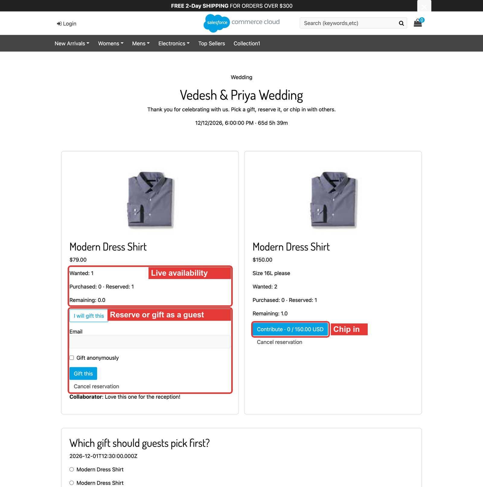

`plugin_socialgifting` is an SFRA overlay cartridge for Salesforce B2C Commerce. Shoppers create a
registry for a wedding, birthday or other event, add exact product variants, and share it. Guests
reserve or buy gifts, chip in together, comment and vote. The recipient's address never leaves the
server.

This is a **cartridge repository**, not a standalone application. It runs on an SFRA storefront and
overlays the Smart Commerce and Wishlist cartridges used in
[SFCC-RefArch](https://github.com/Vedesh-reddy/SFCC-RefArch). No base SFRA code is changed.

```sh
npm ci
npm test       # 42 unit tests
npm run lint
npm run build
```

All screenshots below were captured on sandbox `zyeu-002`, site `RefArch_Practice`, on
8 October 2026, with the cartridge deployed and its metadata imported. Red boxes mark what each
feature adds. Personal address details are blurred or cropped.

## Features

| # | Feature | Who uses it | Entry point |
| --- | --- | --- | --- |
| 1 | [Registries and the registry dashboard](#1-registries-and-the-registry-dashboard) | Owner | My Account → My Registries, `Registry-Dashboard` |
| 2 | [Privacy and participation options](#2-privacy-and-participation-options) | Owner | Manage registry |
| 3 | [Adding exact product variants](#3-adding-exact-product-variants) | Owner, collaborators | Product page, registry page |
| 4 | [Public registry page](#4-public-registry-page) | Guests | `Registry-View?slug=…` |
| 5 | [Reservations and double-gift protection](#5-reservations-and-double-gift-protection) | Guests | Registry page |
| 6 | [Comments](#6-comments) | Members | Registry item cards |
| 7 | [Polls](#7-polls) | Members, optionally guests | Registry page |
| 8 | [Collaborators and invitations](#8-collaborators-and-invitations) | Owner | Collaborators and polls |
| 9 | [Group gifts](#9-group-gifts) | Guests | Contribute button, `GroupGift-View` |
| 10 | [Private gift checkout](#10-private-gift-checkout) | Guests and customers | Gift this |
| 11 | [Activity trail](#11-activity-trail) | Owner, members | Registry page |

---

### 1. Registries and the registry dashboard

**What it does.** A signed-in customer creates a registry for an event: wedding, birthday,
anniversary, baby shower, housewarming, festival or custom. Each registry has a public URL name,
an event date with time zone, a visibility (private, link only, public), a status (draft, active)
and a delivery address chosen from the owner's address book.

**Flow**

1. My Account gets a **My Registries** button.

   

2. **My Registries** lists the customer's registries with live counts.

   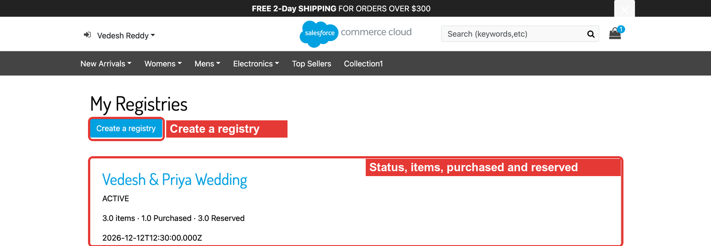

3. **Create a registry** opens the form.

   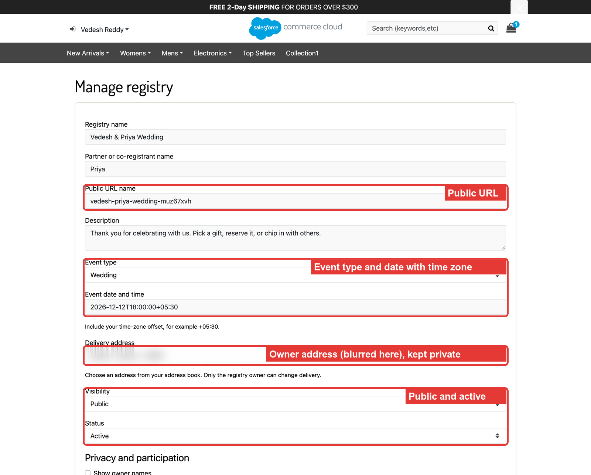

4. The registry page header shows the event, a countdown, and for owners: manage, share link and archive.

   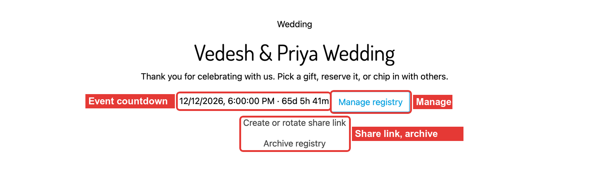

**Rules**

- Registries are native `ProductList.TYPE_GIFT_REGISTRY` lists, separate from the wishlist; `SGRegistry`
  custom objects hold the directory and lifecycle data.
- The delivery address is copied from the owner's address book on the server and never shown to guests.
- Lifecycle: DRAFT → ACTIVE → EVENT_COMPLETED → ARCHIVED. Archived registries are read-only and old share links stop working.
- **Create or rotate share link** issues a new link and invalidates the previous one.

---

### 2. Privacy and participation options

**What it does.** Each registry decides what guests see and what they may do.

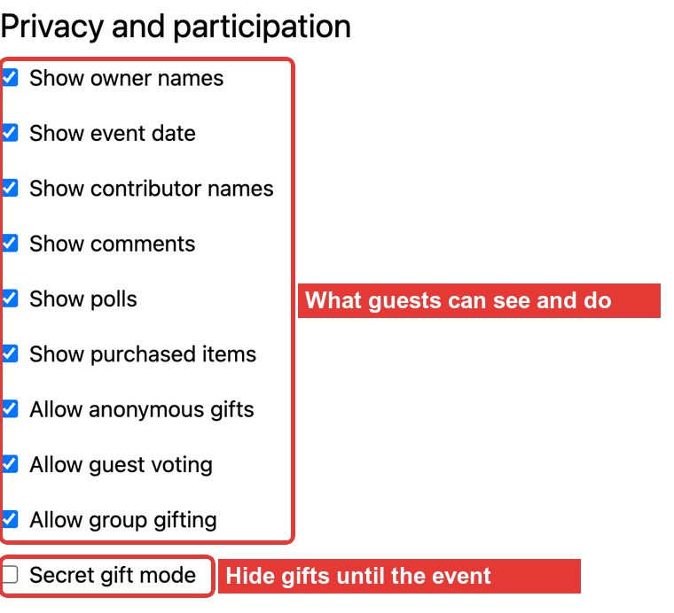

| Option | Effect |
| --- | --- |
| Show owner names / event date / contributor names | Display toggles on the public page |
| Show comments / polls / purchased items | Turns each section on for this registry |
| Allow anonymous gifts | Givers can hide their name from the owner |
| Allow guest voting | Signed-out visitors may vote in polls that allow it |
| Allow group gifting | Items marked for group gifting get a **Contribute** campaign |
| Secret gift mode | Hides purchase, reservation and funding details from owners until the reveal date |

Each option also needs its site-level feature switch (Site Preferences → Social Gifting).

---

### 3. Adding exact product variants

**What it does.** Registry items are always a specific variant, never a master, so givers buy exactly
what was asked for.

1. On the product page, signed-in owners pick a registry and **Add product** for the selected variant.
   The selector follows variation changes.

   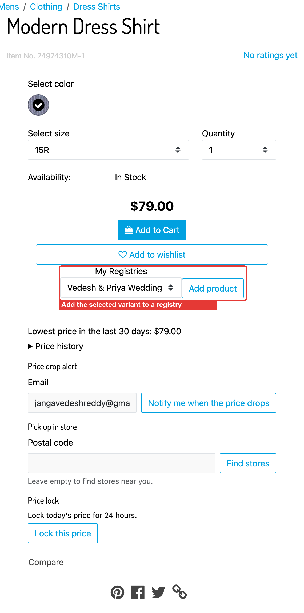

2. Owners can also add by product ID from the registry page, with quantity, notes and group gifting.
   Each item card shows wanted, purchased, reserved and remaining quantities.

   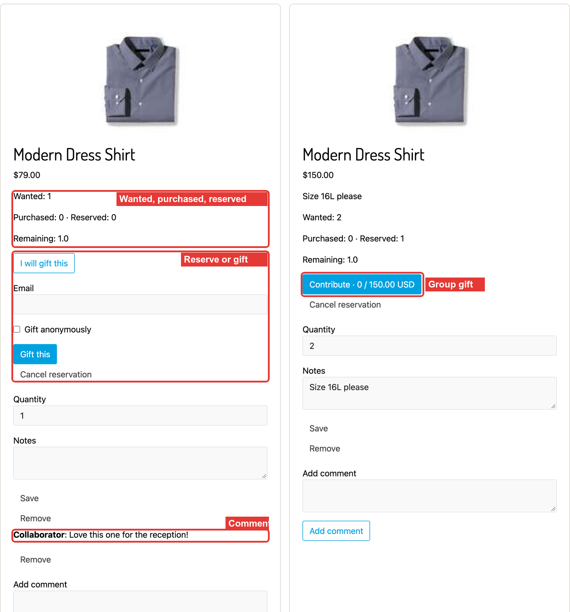

**Rules.** Master products are rejected (`EXACT_PRODUCT_REQUIRED`). Quantities, notes and removal are
limited to owners and editors.

---

### 4. Public registry page

**What it does.** Guests open the registry by its URL and see items with live availability, without
any owner controls.


**Rules.** The page is an explicit projection: it contains no customer numbers, emails, addresses,
payment IDs or tokens. Native product lists stay private.

---

### 5. Reservations and double-gift protection

**What it does.** A guest clicks **I will gift this** to hold a unit while they decide, and the
registry stops anyone else from taking the same unit.

1. After a guest's reservation, the item shows **Reserved: 1** and **Remaining: 0**.

   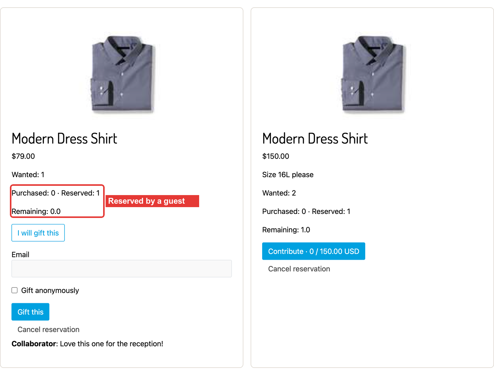

2. Another visitor trying to reserve or buy the same unit is refused.

   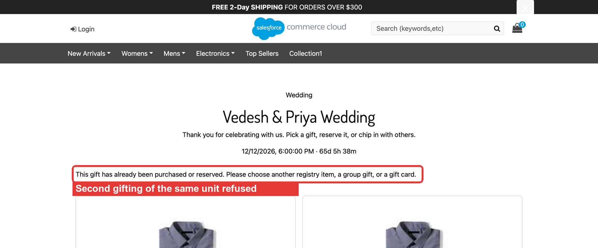

**Rules**

- Every capacity change updates the item aggregate and records a unique `SGMutation` revision claim in
  the same transaction, so two concurrent writers cannot both win.
- Reservations expire after `RegistryReservationMinutes`; the lifecycle job releases expired ones.
- Guest ownership of a reservation is tied to the server-side session.

---

### 6. Comments

**What it does.** Members comment on individual items; comments appear under each item when
**Show comments** is on. The comment in the owner screenshot above ("Love this one for the
reception!") was added through this form.

**Rules.** Comments are limited to `MaxCommentLength`, stored as `SGRegistryComment` custom objects and
always HTML-escaped on output. Authors, and members with moderation rights, can remove them.

---

### 7. Polls

**What it does.** Owners ask guests to choose between registry items, for example which gift to buy first.

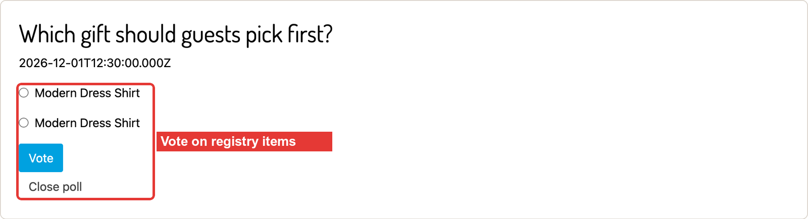

**Rules.** A poll needs at least two items and a closing time. Visibility is members only or all
registry visitors; guest voting, multiple choice and early results are per-poll options. Votes are
deduplicated per customer or guest session.

---

### 8. Collaborators and invitations

**What it does.** The owner invites people by email as viewer, editor or co-owner, and revokes them
later. The same panel creates polls.

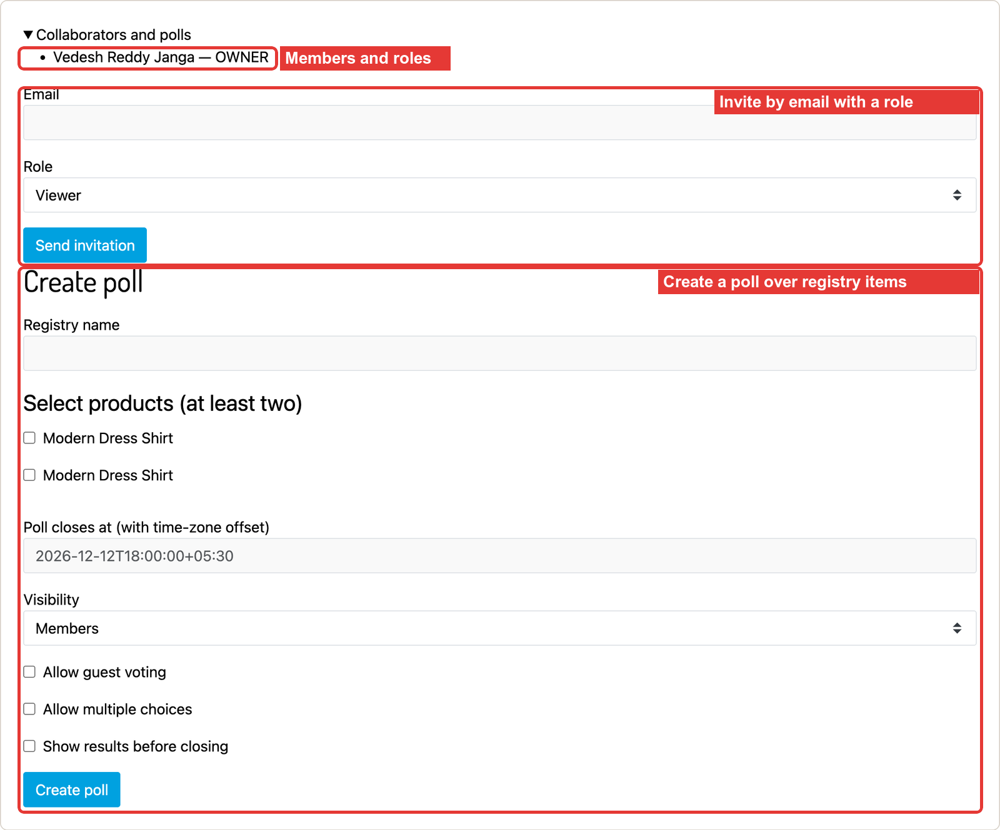

**Rules.** An invitation works only for the person who has the emailed link **and** signs in with
the invited email. Only a digest of the token is stored. Landing pages redirect to clean URLs with
no-referrer and no-store headers.

---

### 9. Group gifts

**What it does.** For expensive items, the owner opens a group gift. Guests see **Contribute ·
collected / target** on the item and chip in any amount through the storefront's existing card checkout.

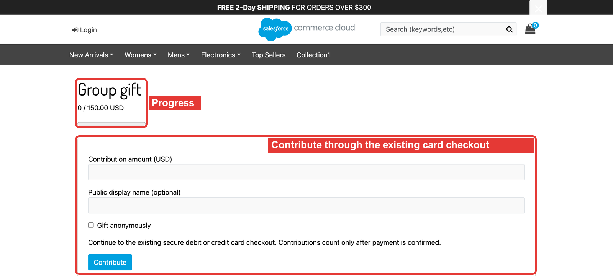

**Rules**

- A campaign holds one unit of the item so it cannot also be bought individually.
- Only placed orders with confirmed payment (`PAYMENT_STATUS_PAID`), the right currency and the exact
  amount count toward the target; `paid + held` never exceeds the target.
- Reaching the target sets the campaign to FUNDED. Fulfilment needs the merchant's
  `app.socialGifting.fulfillment.createOrder` integration — see the
  [cartridge guide](cartridges/plugin_socialgifting/README.md#fulfillment-of-funded-campaigns).
- Contributions need a dedicated funding product (`GroupGiftContributionProductID`).

---

### 10. Private gift checkout

**What it does.** **Gift this** starts a dedicated checkout for that single item, shipped to the
registry recipient. The giver pays with the normal card checkout; the recipient's address is never
shown to them.

1. Checkout starts at payment. Shipping shows "Registry recipient" and a home-delivery method.

   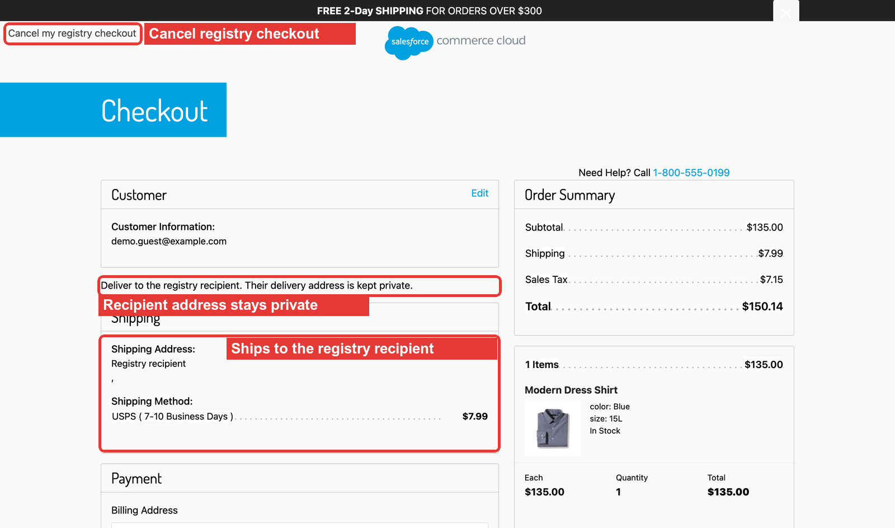

2. Order 00000203 was placed as an anonymous guest gift; the confirmation also hides the address.

   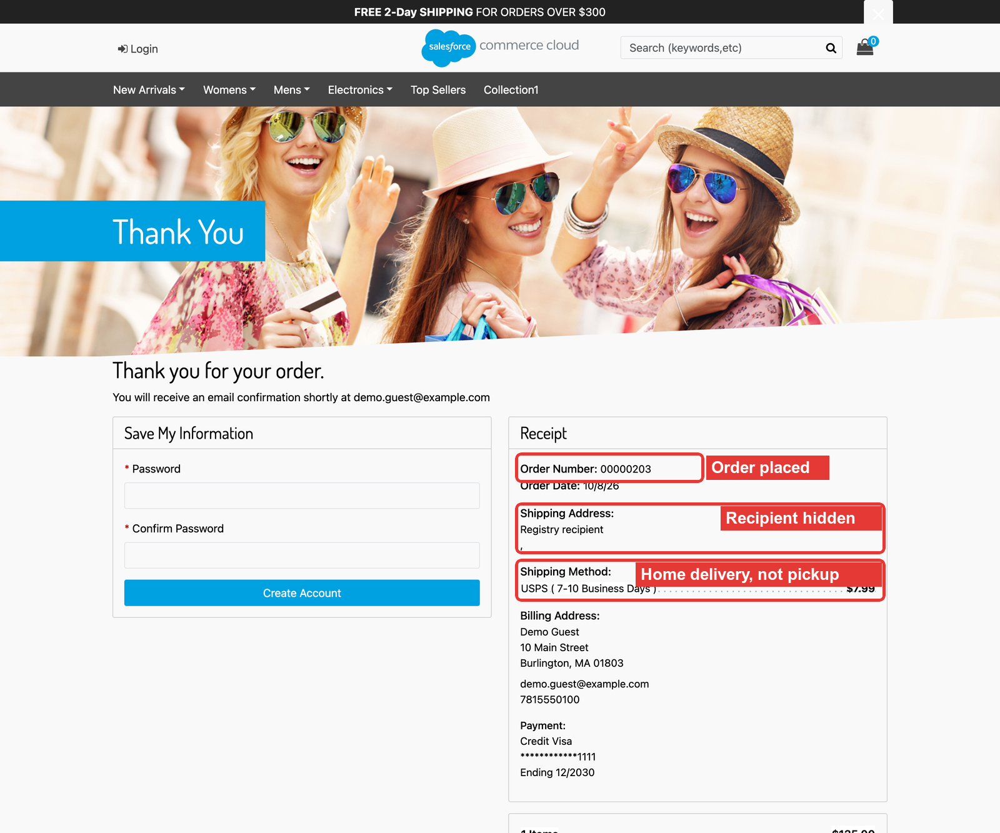

3. The registry counts the purchase.

   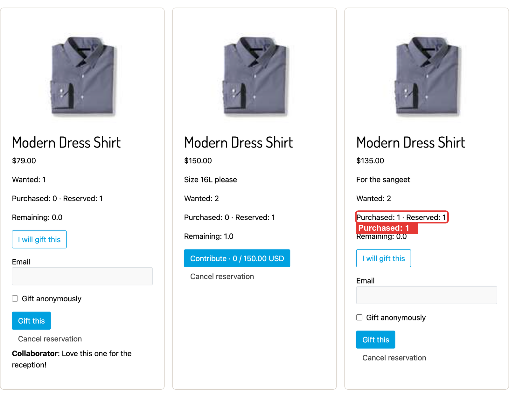

**Rules**

- One registry recipient per basket; mixed baskets, quantity changes, multi-ship, pickup and
  shipping edits are blocked. **Cancel my registry checkout** releases the basket.
- The shipment is marked private; checkout, order and email models redact it.
- Store-pickup shipping methods are never used for registry deliveries; the site default delivery
  method is preferred.
- Purchases are recorded once per order line, even if accounting is retried; order cancellation
  reverses them through the reconciliation job.
- Smart Commerce order editing is disabled for registry and contribution orders.

---

### 11. Activity trail

**What it does.** Owners and members see what happened on the registry.

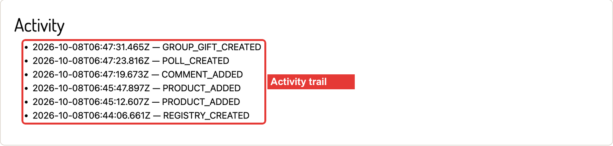

Entries are generic event codes with timestamps; they never include donor names, items bought in
secret mode, or addresses.

## Setup

Follow the [installation and integration guide](cartridges/plugin_socialgifting/README.md):

1. Import `metadata/social-gifting` (custom objects, preferences, order and basket attributes)
   **before** adding the cartridge to the site path.
2. Build and upload `plugin_socialgifting`, then prepend it to the cartridge path.
3. Enable `SocialGiftingEnabled` and the features you need in Site Preferences → Social Gifting.
4. Schedule the jobs in `metadata/social-gifting/jobs.xml` (imported without triggers).

## Verification status

What was exercised live and what still needs merchant integration is listed in the
[verification report](cartridges/plugin_socialgifting/docs/verification.md).
