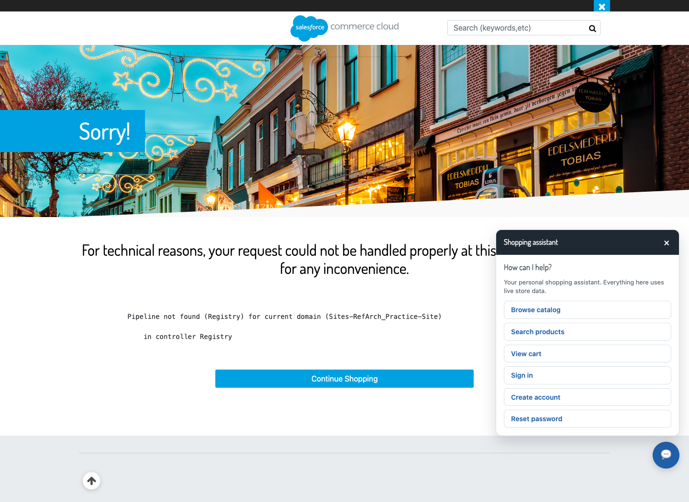

# plugin_socialgifting

Social gifting and event registries for Salesforce B2C Commerce SFRA, with shared lists, roles, comments, polls, reservations and contributions through the storefront’s existing card checkout.

This is a standalone **cartridge repository**, not a standalone web application. It requires the SFRA storefront and the Smart Commerce/Wishlist overlays used by [SFCC-RefArch](https://github.com/Vedesh-reddy/SFCC-RefArch). No base SFRA or other cartridges are bundled here.

```sh
npm ci
npm test
npm run lint
npm run build
```

- [Installation, payment contract and remaining integration work](cartridges/plugin_socialgifting/README.md)
- [Verification report and actual storefront screenshots](cartridges/plugin_socialgifting/docs/verification.md)
- [Architecture](docs/social-gifting-architecture.md)
- [Metadata and unscheduled job definitions](metadata/social-gifting)

Import metadata before adding the cartridge to the site path. Features default to disabled. Live card capture/refund, private delivery and concurrent checkout still need storefront verification; group-gift fulfillment requires the merchant integration described in the guide.

Keep credentials in an ignored local `dw.json` or environment configuration. Never commit session cookies or concurrency fixture secrets.

## Social gifting storefront screenshots

Actual Chrome captures of the current storefront. The registry feature is not active yet.

### Existing storefront

The homepage loads successfully (HTTP 200).


### Registry activation blocker

`Registry-Dashboard` returns HTTP 500: “Pipeline not found (Registry)”. This records the missing activation, not a working registry screen.


